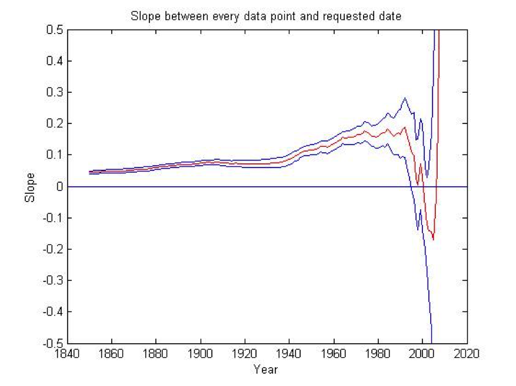
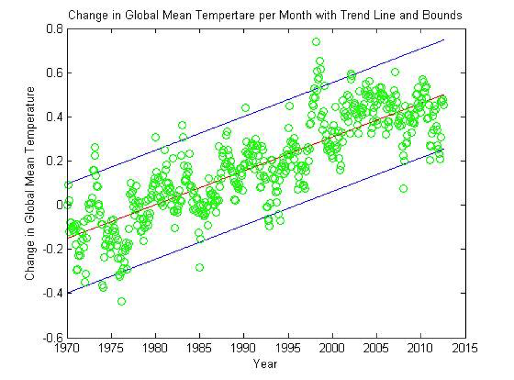

# The Meaning of 'Statistically Significant Global Warming'
This repository contains a MATLAB function that analyzes historical climate data to better understand the meaning of statistically significant climate change, and the time period needed to measure statistically significant results. The write up of the study is below. The data is not mine and not available in he repository.

## Introduction
In early 2010, the BBC asked Phil Jones the director of the Climate Research Unit at the University of East Anglia (UK) “Do you agree that from 1995 to the present there has been no statistically-significant global warming?” and “Do you agree that from January 2002 to the present there has been statistically significant global cooling?”  Jones responded to the first:

>Yes, but only just. I also calculated the trend for the period 1995 to 2009. This trend (0.12C per decade) is positive, but not significant at the 95% significance level. The positive trend is quite close to the significance level. Achieving statistical significance in scientific terms is much more likely for longer periods, and much less likely for shorter periods.

Jones responded to the second “No. This period is even shorter than 1995-2009. The trend this time is negative (-0.12C per decade), but this trend is not statistically significant.”
The authenticity of these questions and answers are analyzed using MATLAB.
## Methods
Three tests are ran on Jones’ data (not contained in this repository). The first test determines the slope and the 95% confidence interval of the slope between every data point and a desired target date. The slopes indicate change in mean global temperature from every data point and the desired target date. The second test determines the slope of every specified time period in the record along with a 95% confidence interval. This is used to determine how long of a period we need to measure to have statistically significant slopes. The last test is to determine a linear trend and 95% confidence intervals of the data since 1970. This trend line shows if the years in question by the BBC reporter are really different than the previous years.
## Results 

The above figure is the output of the first test. Slopes from every year to 2009 in red. Blue lines are 95% confidence interval. The straight line marks 0. The confidence interval contains 0 in every year after 1994. The first test confirms Jones’s responses. The first test determines the slope from 1995 to 2009 and from 2002 to 2009. From 1995 to 2009 there is a positive slope (.1084 degrees C), which indicates global warming. However, the lower bound of the 95% confidence interval is -0.0113. Because the lower bound of the 95% confidence interval contains zero, the data is not statistically significant at the 95% confidence interval. The slope from 2002 to 2009 is negative, indicating global cooling. However, again the lower bound of the 95% confidence interval contains zero, and the data is not statistically significant.  

Jones’ makes the important observation stating that “Achieving statistical significance in scientific terms is much more likely for longer periods, and much less likely for shorter periods.” The second test determines the period length needed to achieve statistically significant data. The test agrees with Jones; over longer periods of time, more of the data becomes statistically significant. Over shorter periods of time, such as those requested by the reporter, it is unlikely that the data will be statistically significant. Over a period of 86 years minimum, all the data is statistically significant. All the slopes are statistically significant when calculated over an 86 year period or greater.  The trend line test indicates that even though the data for the years in question by the BBC reporter is not statistically significant, it is in accordance with the warming trend since 1970. The image below is the output of the second test. Green circles are monthly changes in mean global temperature. Red line is the trend lines, blue lines are the 95% confidence intervals.

## Conclusion
Jones was correct in his response that from 1995 to 2009 there has been no statistically significant global warming. This statement could easily been mistaken to mean that there is no global warming, as several news outlets apparently reported. However, that is not what the data says. The trend line of the data shows that although the specific time period is not statistically significant the warming trend from 1970 continues in 1995 to 2009. The second test, to determine statistically significant periods, indicates that the time span in question is just too small to draw any statistically significant conclusions. The BBC reporter should have then asked about a longer period; but instead followed up the question with an even shorter period.  This shows that reporter either does not understand statistics, or is biased towards a global cooling story. The nature of the questions, and the specific years questioned indicates that the reporter does in fact understand statistics and is attempting a biased piece against global warming. For example, the slopes from 1994 and all other years before 1995 to 2009 are statistically significant and indicate global warming. 
